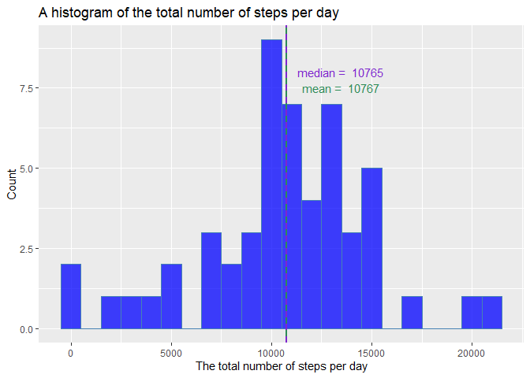
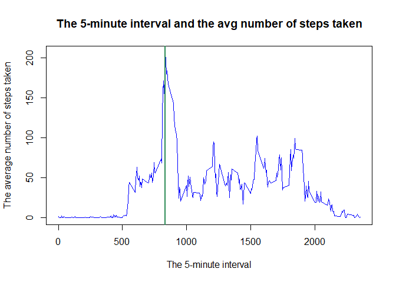
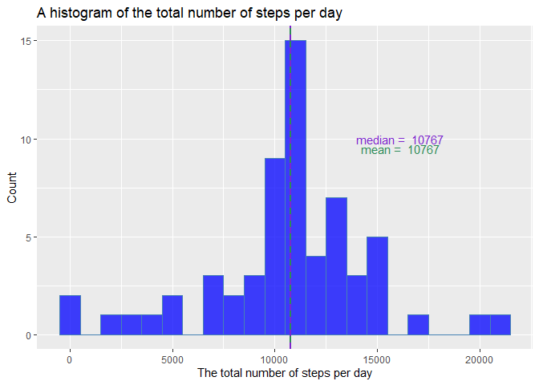
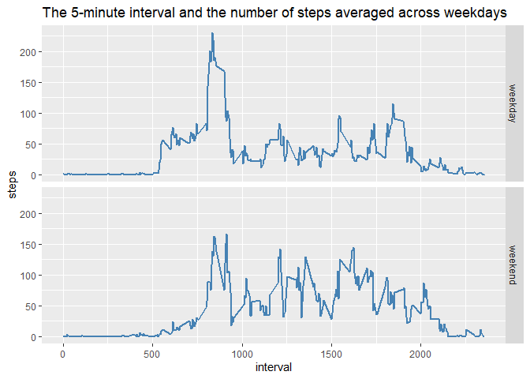

## Loading and preprocessing the data

```r
activity <- read.csv('activity.csv', header = TRUE, na.strings = 'NA', colClasses = c('numeric', 'character', 'numeric'))
activity$date <- as.Date(activity$date, '%Y-%m-%d')
str(activity)
```

```
## 'data.frame':	17568 obs. of  3 variables:
##  $ steps   : num  NA NA NA NA NA NA NA NA NA NA ...
##  $ date    : Date, format: "2012-10-01" "2012-10-01" ...
##  $ interval: num  0 5 10 15 20 25 30 35 40 45 ...
```

## What is mean total number of steps taken per day?

A data processing to calculate the total number of steps taken each day


```r
sumsteps <- tapply(activity$steps, activity$date, sum)
dfsum <- data.frame(date = names(sumsteps), sum.steps = sumsteps)
head(dfsum)
```

```
##                  date sum.steps
## 2012-10-01 2012-10-01        NA
## 2012-10-02 2012-10-02       126
## 2012-10-03 2012-10-03     11352
## 2012-10-04 2012-10-04     12116
## 2012-10-05 2012-10-05     13294
## 2012-10-06 2012-10-06     15420
```
Calculations of the mean and median of total number of steps taken each day


```r
meansteps <- ceiling(mean(dfsum$sum.steps, na.rm = TRUE))
mediansteps <- ceiling(median(dfsum$sum.steps, na.rm = TRUE))
```

The mean of total number of steps per day is **1.0767\times 10^{4}** and the median is **1.0765\times 10^{4}**.

A histogram of the total number of steps taken each day with mean and median of the total number of steps taken each day 


```r
library(ggplot2)
gghist <- ggplot(dfsum, aes(sum.steps)) + 
                geom_histogram(binwidth = 1000,
                               fill = 'blue',
                               color = 'steelblue',
                               alpha = 0.75,
                               na.rm = TRUE) + 
                labs(title = 'A histogram of the total number of steps per day') + 
                labs(x = 'The total number of steps per day') + 
                labs(y = 'Count')
gghist +
        geom_vline(xintercept = meansteps,
                   col = 'seagreen',
                   lwd = 1) +
        annotate('text',
                 x = meansteps * 1.25,
                 y = 7.5,
                 label = paste('mean = ', meansteps),
                 col = 'seagreen',
                 size = 4) +
        geom_vline(xintercept = mediansteps,
                   col = 'purple3',
                   lwd = 1,
                   linetype = 2) +
        annotate('text',
                 x = meansteps * 1.25,
                 y = 8,
                 label = paste('median = ', mediansteps),
                 col = 'purple3',
                 size = 4)
```

<!-- -->

## What is the average daily activity pattern?

Calculations for the average daily activity pattern


```r
avgsteps <- tapply(activity$steps, activity$interval, mean, na.rm = TRUE)
dfavg <- data.frame(interval = names(avgsteps), avg.steps = avgsteps)
head(dfavg)
```

```
##    interval avg.steps
## 0         0 1.7169811
## 5         5 0.3396226
## 10       10 0.1320755
## 15       15 0.1509434
## 20       20 0.0754717
## 25       25 2.0943396
```

Maximum number of steps in 5-minute interval


```r
maxsteps <- max(dfavg$avg.steps)
maxinterval <- dfavg$interval[dfavg$avg.steps == maxsteps]
```

The interval **835**, on average across all days in the data set, contains **206.17** steps.

The time series plot of 5-minute interval and the average number of steps taken (the green line indicates the maximum number of steps).


```r
with(dfavg, plot(interval, avg.steps,
                 type = 'l',
                 col = 'blue',
                 lwd = 1,
                 main = 'The 5-minute interval and the avg number of steps taken',
                 xlab = 'The 5-minute interval',
                 ylab = 'The average number of steps taken'))
abline(v = maxinterval, col = 'seagreen', lwd = 2)
```

<!-- -->

## Imputing missing values

The total number of missing values calculation


```r
totalna <- sum(is.na(activity))
```

**2304** values are missing in the data set.

Filling in all of the missing values in the data set using the mean for 5-minute interval (calculated above in dfavg data frame)


```r
copy.activity <- data.frame(activity)

copy.activity$steps[is.na(copy.activity$steps)] <- dfavg$avg.steps[match(copy.activity$interval,dfavg$interval)][which(is.na(copy.activity$steps))]

sum(is.na(copy.activity))
```

```
## [1] 0
```

A data processing to calculate the total number of steps taken each day


```r
sumsteps2 <- tapply(copy.activity$steps, copy.activity$date, sum)
dfsum2 <- data.frame(date = names(sumsteps2), sum.steps = sumsteps2)
head(dfsum2)
```

```
##                  date sum.steps
## 2012-10-01 2012-10-01  10766.19
## 2012-10-02 2012-10-02    126.00
## 2012-10-03 2012-10-03  11352.00
## 2012-10-04 2012-10-04  12116.00
## 2012-10-05 2012-10-05  13294.00
## 2012-10-06 2012-10-06  15420.00
```

Calculations of the mean and median of total number of steps taken each day


```r
meansteps2 <- ceiling(mean(dfsum2$sum.steps, na.rm = TRUE))
mediansteps2 <- ceiling(median(dfsum2$sum.steps, na.rm = TRUE))
```

The mean of total number of steps per day in data set without missing values is **1.0767\times 10^{4}** (it was **1.0767\times 10^{4}** ) and the median is **1.0767\times 10^{4}** (it was **1.0765\times 10^{4}**).

A histogram of the total number of steps taken each day with mean and median of the total number of steps taken each day 


```r
library(ggplot2)
gghist2 <- ggplot(dfsum2, aes(sum.steps)) + 
                geom_histogram(binwidth = 1000,
                               fill = 'blue',
                               color = 'steelblue',
                               alpha = 0.75,
                               na.rm = TRUE) + 
                labs(title = 'A histogram of the total number of steps per day') + 
                labs(x = 'The total number of steps per day') + 
                labs(y = 'Count')
gghist2 +
        geom_vline(xintercept = meansteps2,
                   col = 'seagreen',
                   lwd = 1) +
        annotate('text',
                 x = meansteps2 * 1.5,
                 y = 9.5,
                 label = paste('mean = ', meansteps2),
                 col = 'seagreen',
                 size = 4) +
        geom_vline(xintercept = mediansteps2,
                   col = 'purple3',
                   lwd = 1,
                   linetype = 2) +
        annotate('text',
                 x = meansteps2 * 1.5,
                 y = 10,
                 label = paste('median = ', mediansteps2),
                 col = 'purple3',
                 size = 4)
```

<!-- -->

## Are there differences in activity patterns between weekdays and weekends?

Creating a new factor variable in the data set with two levels – “weekday” and “weekend” indicating whether a given date is a weekday or weekend day.


```r
library(dplyr)
```

```
## 
## Dołączanie pakietu: 'dplyr'
```

```
## Następujące obiekty zostały zakryte z 'package:stats':
## 
##     filter, lag
```

```
## Następujące obiekty zostały zakryte z 'package:base':
## 
##     intersect, setdiff, setequal, union
```

```r
weekactive <- copy.activity %>% mutate(weekday = factor(weekdays(date)))

levels(weekactive$weekday)[!levels(weekactive$weekday) %in% c('Saturday', 'Sunday')] <- 'weekday'

levels(weekactive$weekday)[levels(weekactive$weekday) %in% c('Saturday', 'Sunday')] <- 'weekend'

str(weekactive)
```

```
## 'data.frame':	17568 obs. of  4 variables:
##  $ steps   : num  1.717 0.3396 0.1321 0.1509 0.0755 ...
##  $ date    : Date, format: "2012-10-01" "2012-10-01" ...
##  $ interval: num  0 5 10 15 20 25 30 35 40 45 ...
##  $ weekday : Factor w/ 2 levels "weekday","weekend": 1 1 1 1 1 1 1 1 1 1 ...
```

Calculations for the average daily activity pattern


```r
library(dplyr)
grouped <- weekactive %>% group_by(weekday, interval) %>% summarize(steps = mean(steps, na.rm = TRUE))
```

```
## `summarise()` has grouped output by 'weekday'. You can override using the
## `.groups` argument.
```

```r
head(grouped)
```

```
## # A tibble: 6 × 3
## # Groups:   weekday [1]
##   weekday interval  steps
##   <fct>      <dbl>  <dbl>
## 1 weekday        0 2.25  
## 2 weekday        5 0.445 
## 3 weekday       10 0.173 
## 4 weekday       15 0.198 
## 5 weekday       20 0.0990
## 6 weekday       25 1.59
```

A panel plot containing a time series plot of the 5-minute interval (x-axis) and the average number of steps taken, averaged across all weekday days or weekend days (y-axis).


```r
g <- ggplot(grouped, aes(interval, steps))
g + geom_line(color = 'steelblue', lwd = 0.75) +
        facet_grid(weekday~.) +
        labs(title = 'The 5-minute interval and the number of steps averaged across weekdays')
```

<!-- -->
